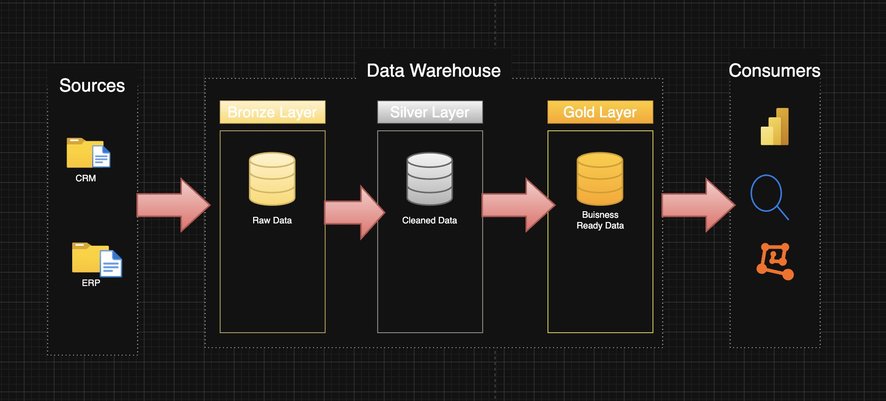

# 📊 Data Warehouse & Analytics Project

This repository presents a complete end-to-end **Data Warehousing and Analytics** solution. Designed as a portfolio project, it replicates real-world data engineering and analysis practices using the **Medallion Architecture** and **SQL Server**. The goal is to extract valuable business insights from ERP and CRM datasets using robust ETL pipelines, data modeling, and reporting.

---

## 🏗️ Data Architecture: Medallion Approach

We use the **Medallion Architecture** to structure the data warehouse in three layers:

### 🔹 Bronze Layer  
- Raw data ingestion from CSV files  
- Stored in SQL Server as-is from **ERP** and **CRM** sources  

### 🔸 Silver Layer  
- Data cleansing, deduplication, standardization, and transformation  
- Prepares data for efficient querying and analysis  

### 🥇 Gold Layer  
- Final analytical layer with **star schema** design  
- Fact and dimension tables optimized for BI and SQL-based reporting  

---

## 📖 Project Overview

### ✅ What’s Covered

1. **Data Architecture** – Modern DW design using the Medallion model  
2. **ETL Pipelines** – Extraction from CSVs, transformation logic, and loading into SQL tables  
3. **Data Modeling** – Creation of fact and dimension tables  
4. **Analytics & Reporting** – SQL queries and dashboards to extract key business insights  

---

## 🎯 Skills & Roles Demonstrated

This project is ideal for showcasing skills in:

- 📌 SQL Development  
- 🛠️ Data Engineering  
- 🔁 ETL Pipeline Development  
- 🧱 Data Modeling (Star Schema)  
- 📈 Data Analytics  
- 🧩 Data Architecture Design  

---

## 🛠️ Tools & Resources (All Free!)

| Tool | Purpose |
|------|---------|
| **MYSQL** | Host the Data Warehouse |
| **CSV Files** | Source ERP and CRM datasets |
| **GitHub** | Version control and codebase management |
| **Draw.io** | Diagram architecture and data models |
| **Notion** | Project planning & templates |

---

## 🚀 Project Requirements & Workflow

### 📦 Data Engineering

**Goal**: Build a scalable  MY-SQL based Data Warehouse from raw ERP and CRM data.

**Tasks**:
- ✅ Import data from CSV files
- ✅ Cleanse and transform the data (Silver Layer)
- ✅ Merge sources into a unified, business-ready data model (Gold Layer)
- ✅ Create documentation for tables, schema, and flow

### 📈 Data Analysis

**Goal**: Generate meaningful insights using SQL queries for:

- Customer Segmentation & Behavior
- Product Performance Trends
- Monthly/Quarterly Sales Analysis
- Revenue by Region, Channel, and Category

---

